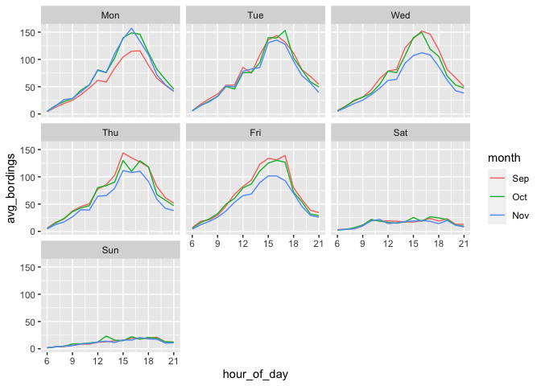

Author: JIYOU CHEN LIMING PANG YUXIN FENG

#Question 1

##problem 1.1
 As shown in
the chart, the peak boarding times on weekdays (i.e., Monday through
Friday) show a very similar trend throughout the day. Each day of the
workday peaks between 15 and 18 o ’clock. However, the trend on Saturday
and Sunday is much flatter than it is on weekdays. Meanwhile, it is
difficult to identify the peak time. Although the trend is the same on
Saturday and Sunday.

Students in September have just finished the long summer vacation, so
they are not able to quickly get into the rhythm of study, so they will
not go to school on Monday after the weekend.

Wednesdays through Fridays in November are the Thanksgiving holiday, and
few students take the bus these days, which directly lowers the average
ridership.

##problem 1.2
 In fact,
according to the graph drawn from the data, temperature has no
significant influence on UT students’ bus ride, and the influence on
them is still mainly time change. The number of bus passengers on
weekends is still less than on weekdays, no matter how the temperature
changes.

#Question 2

    ## errs_lm1 errs_lm2 errs_lm3 errs_lm4 
    ## 77284.37 66899.27 68239.26 61375.30

##Part II

    ##       k      err  std_err
    ## knn1 45 77399.85 2033.164

    ##       k      err std_err
    ## knn2 35 68713.81 2066.56

    ##       k     err  std_err
    ## knn3 15 70805.5 2360.673

    ##       k     err  std_err
    ## knn4 15 70805.5 2360.673

##compare two models

    ## errs_lm1 errs_lm2 errs_lm3 errs_lm4 
    ## 77284.37 66899.27 68239.26 61375.30

    ##       k      err  std_err
    ## knn1 45 77399.85 2033.164
    ## knn2 35 68713.81 2066.560
    ## knn3 15 70805.50 2360.673
    ## knn4 15 70805.50 2360.673

report for question 2

By adding and subtract variables, we find that a model that includes
variables such as: rooms:bathrooms and living Area : rooms but not
variables such as pctCollege, sewers and NewConstruction results in a
better model. These results suggests that when the government make the
tax policy need to focus on above variables. For example, a house with
more rooms in living area has higher valuation. Also, during these
rooms, the more bedrooms, the higher price of this house. Besides,
customers do not concern about such as type of sewer or whether this
house is new construction or not. These factors are not influence on the
willingness of house buyer. Therefore, when the government is making tax
policy on the real estate, the feature above said should be consider at
first. More bedrooms are included in bathrooms, more rooms are included
in living area have higher market value of properties and should be make
higher tax policy on it. From the model’s perspective, linear regression
model performs better than KNN model. Linear regression is a parametric
approach and K-Nearest Neighbors (KNN) is a non-parametric method.
According to the result, KNN model 4 seems to do better performance
(RMSE: 70486.78) during four KNN models. However, linear regression
model 4 have lower out-of-sample mean-squared error (52387.44), which
means it is the lowest out-of-sample mean-squared error in two types of
models. So, linear regression model is a better model able to fit this
data set. Therefore, linear regression model is the best price-modeling
strategies among these two methods for taxing authority.

#Question3

##Bar plot of default probability by credit history

    ## 
    ## Call:
    ## glm(formula = Default ~ duration + amount + installment + age + 
    ##     history + purpose + foreign, family = "binomial", data = german_credit)
    ## 
    ## Deviance Residuals: 
    ##     Min       1Q   Median       3Q      Max  
    ## -2.3464  -0.8050  -0.5751   1.0250   2.4767  
    ## 
    ## Coefficients:
    ##                       Estimate Std. Error z value Pr(>|z|)    
    ## (Intercept)         -7.075e-01  4.726e-01  -1.497  0.13435    
    ## duration             2.526e-02  8.100e-03   3.118  0.00182 ** 
    ## amount               9.596e-05  3.650e-05   2.629  0.00856 ** 
    ## installment          2.216e-01  7.626e-02   2.906  0.00366 ** 
    ## age                 -2.018e-02  7.224e-03  -2.794  0.00521 ** 
    ## historypoor         -1.108e+00  2.473e-01  -4.479 7.51e-06 ***
    ## historyterrible     -1.885e+00  2.822e-01  -6.679 2.41e-11 ***
    ## purposeedu           7.248e-01  3.707e-01   1.955  0.05058 .  
    ## purposegoods/repair  1.049e-01  2.573e-01   0.408  0.68346    
    ## purposenewcar        8.545e-01  2.773e-01   3.081  0.00206 ** 
    ## purposeusedcar      -7.959e-01  3.598e-01  -2.212  0.02694 *  
    ## foreigngerman       -1.265e+00  5.773e-01  -2.191  0.02849 *  
    ## ---
    ## Signif. codes:  0 '***' 0.001 '**' 0.01 '*' 0.05 '.' 0.1 ' ' 1
    ## 
    ## (Dispersion parameter for binomial family taken to be 1)
    ## 
    ##     Null deviance: 1221.7  on 999  degrees of freedom
    ## Residual deviance: 1070.0  on 988  degrees of freedom
    ## AIC: 1094
    ## 
    ## Number of Fisher Scoring iterations: 4

History has the negative related with default, and it is statistically
significant. So, this means people who with good credit are more likely
to default. This is contrary to the facts. Therefore this is not a good
model. The reason is that bank make a lot of matching for defaults,
which directly reduces the proportion of non-defaulters in the entire
bank credit system, leading to the deviation of the accuracy of the
model. I would suggest that banks adopt random sampling to consider the
true proportion of each credit tier in the entire banking system and
conduct regression analysis.

#Question 4 ##Baseline1

    ## lm(formula = children ~ market_segment + adults + customer_type + 
    ##     is_repeated_guest, data = hotels_dev)

##baseline2

    ## lm(formula = children ~ . - (arrival_date) - (children), data = hotels_dev)

##New model

    ## Start:  AIC=-117010.6
    ## children ~ 1
    ## 
    ##                           Df Sum of Sq    RSS     AIC
    ## + average_daily_rate       1   284.239 3057.1 -121009
    ## + market_segment           6    91.930 3249.4 -118254
    ## + customer_type            3    44.582 3296.8 -117609
    ## + poly(adults, 2)          2    17.812 3323.6 -117247
    ## + meal                     4    16.867 3324.5 -117230
    ## + is_repeated_guest        1     6.256 3335.1 -117093
    ## + stays_in_weekend_nights  1     2.978 3338.4 -117049
    ## + lead_time                1     0.606 3340.8 -117017
    ## <none>                                 3341.4 -117011
    ## 
    ## Step:  AIC=-121009.3
    ## children ~ average_daily_rate
    ## 
    ##                           Df Sum of Sq    RSS     AIC
    ## + market_segment           6   29.5068 3027.6 -121434
    ## + customer_type            3   17.5578 3039.6 -121263
    ## + meal                     4   15.7053 3041.4 -121233
    ## + poly(adults, 2)          2    8.4928 3048.6 -121131
    ## + lead_time                1    1.2926 3055.8 -121026
    ## + stays_in_weekend_nights  1    1.0513 3056.1 -121023
    ## <none>                                 3057.1 -121009
    ## + is_repeated_guest        1    0.0425 3057.1 -121008
    ## 
    ## Step:  AIC=-121433.8
    ## children ~ average_daily_rate + market_segment
    ## 
    ##                                     Df Sum of Sq    RSS     AIC
    ## + average_daily_rate:market_segment  6    33.834 2993.8 -121927
    ## + meal                               4    17.419 3010.2 -121685
    ## + poly(adults, 2)                    2     9.675 3017.9 -121574
    ## + customer_type                      3     5.750 3021.9 -121513
    ## + stays_in_weekend_nights            1     1.923 3025.7 -121460
    ## <none>                                           3027.6 -121434
    ## + is_repeated_guest                  1     0.068 3027.6 -121433
    ## + lead_time                          1     0.060 3027.6 -121433
    ## 
    ## Step:  AIC=-121927.5
    ## children ~ average_daily_rate + market_segment + average_daily_rate:market_segment
    ## 
    ##                           Df Sum of Sq    RSS     AIC
    ## + meal                     4   15.4861 2978.3 -122153
    ## + poly(adults, 2)          2   11.3460 2982.4 -122094
    ## + customer_type            3    3.4090 2990.4 -121973
    ## + stays_in_weekend_nights  1    1.3423 2992.4 -121946
    ## + lead_time                1    0.3558 2993.4 -121931
    ## <none>                                 2993.8 -121927
    ## + is_repeated_guest        1    0.0872 2993.7 -121927
    ## 
    ## Step:  AIC=-122152.9
    ## children ~ average_daily_rate + market_segment + meal + average_daily_rate:market_segment
    ## 
    ##                           Df Sum of Sq    RSS     AIC
    ## + poly(adults, 2)          2   12.8370 2965.5 -122343
    ## + average_daily_rate:meal  4   12.6122 2965.7 -122336
    ## + customer_type            3    4.0127 2974.3 -122208
    ## + meal:market_segment     20    4.0754 2974.2 -122174
    ## + stays_in_weekend_nights  1    0.9182 2977.4 -122165
    ## + lead_time                1    0.2559 2978.1 -122155
    ## <none>                                 2978.3 -122153
    ## + is_repeated_guest        1    0.1235 2978.2 -122153
    ## 
    ## Step:  AIC=-122343.2
    ## children ~ average_daily_rate + market_segment + meal + poly(adults, 
    ##     2) + average_daily_rate:market_segment
    ## 
    ##                                      Df Sum of Sq    RSS     AIC
    ## + poly(adults, 2):average_daily_rate  2   25.3911 2940.1 -122726
    ## + average_daily_rate:meal             4   14.4958 2951.0 -122556
    ## + poly(adults, 2):market_segment     11   11.7504 2953.7 -122500
    ## + customer_type                       3    4.7373 2960.7 -122409
    ## + meal:market_segment                20    4.1272 2961.3 -122366
    ## + poly(adults, 2):meal                8    2.2020 2963.3 -122361
    ## + stays_in_weekend_nights             1    1.1342 2964.3 -122358
    ## + lead_time                           1    0.4218 2965.1 -122348
    ## + is_repeated_guest                   1    0.1436 2965.3 -122343
    ## <none>                                            2965.5 -122343
    ## 
    ## Step:  AIC=-122726.2
    ## children ~ average_daily_rate + market_segment + meal + poly(adults, 
    ##     2) + average_daily_rate:market_segment + average_daily_rate:poly(adults, 
    ##     2)
    ## 
    ##                                  Df Sum of Sq    RSS     AIC
    ## + poly(adults, 2):market_segment 11   14.7396 2925.3 -122930
    ## + average_daily_rate:meal         4   11.8253 2928.2 -122900
    ## + customer_type                   3    4.8015 2935.3 -122794
    ## + meal:market_segment            20    3.5073 2936.6 -122740
    ## + stays_in_weekend_nights         1    0.9483 2939.1 -122739
    ## + poly(adults, 2):meal            8    1.2728 2938.8 -122730
    ## + lead_time                       1    0.2903 2939.8 -122729
    ## + is_repeated_guest               1    0.2702 2939.8 -122728
    ## <none>                                        2940.1 -122726
    ## 
    ## Step:  AIC=-122930.4
    ## children ~ average_daily_rate + market_segment + meal + poly(adults, 
    ##     2) + average_daily_rate:market_segment + average_daily_rate:poly(adults, 
    ##     2) + market_segment:poly(adults, 2)
    ## 
    ##                           Df Sum of Sq    RSS     AIC
    ## + average_daily_rate:meal  4   11.6016 2913.7 -123101
    ## + customer_type            3    4.7849 2920.6 -122998
    ## + meal:market_segment     20    3.7871 2921.6 -122949
    ## + stays_in_weekend_nights  1    0.8607 2924.5 -122942
    ## + poly(adults, 2):meal     8    1.5013 2923.8 -122937
    ## + lead_time                1    0.3207 2925.0 -122933
    ## + is_repeated_guest        1    0.1999 2925.1 -122931
    ## <none>                                 2925.3 -122930
    ## 
    ## Step:  AIC=-123101.2
    ## children ~ average_daily_rate + market_segment + meal + poly(adults, 
    ##     2) + average_daily_rate:market_segment + average_daily_rate:poly(adults, 
    ##     2) + market_segment:poly(adults, 2) + average_daily_rate:meal
    ## 
    ##                           Df Sum of Sq    RSS     AIC
    ## + customer_type            3    4.5817 2909.2 -123166
    ## + poly(adults, 2):meal     8    2.9980 2910.7 -123131
    ## + meal:market_segment     20    3.3821 2910.3 -123113
    ## + stays_in_weekend_nights  1    0.6036 2913.1 -123108
    ## + lead_time                1    0.2275 2913.5 -123103
    ## + is_repeated_guest        1    0.2172 2913.5 -123103
    ## <none>                                 2913.7 -123101
    ## 
    ## Step:  AIC=-123166
    ## children ~ average_daily_rate + market_segment + meal + poly(adults, 
    ##     2) + customer_type + average_daily_rate:market_segment + 
    ##     average_daily_rate:poly(adults, 2) + market_segment:poly(adults, 
    ##     2) + average_daily_rate:meal
    ## 
    ##                                    Df Sum of Sq    RSS     AIC
    ## + poly(adults, 2):customer_type     6   10.8688 2898.3 -123322
    ## + average_daily_rate:customer_type  3    6.1490 2903.0 -123255
    ## + market_segment:customer_type     16    4.9024 2904.2 -123210
    ## + poly(adults, 2):meal              8    3.0543 2906.1 -123197
    ## + meal:customer_type               12    2.7367 2906.4 -123184
    ## + lead_time                         1    0.6640 2908.5 -123174
    ## + meal:market_segment              20    3.1145 2906.0 -123174
    ## + stays_in_weekend_nights           1    0.4081 2908.8 -123170
    ## + is_repeated_guest                 1    0.3637 2908.8 -123170
    ## <none>                                          2909.2 -123166
    ## 
    ## Step:  AIC=-123322.4
    ## children ~ average_daily_rate + market_segment + meal + poly(adults, 
    ##     2) + customer_type + average_daily_rate:market_segment + 
    ##     average_daily_rate:poly(adults, 2) + market_segment:poly(adults, 
    ##     2) + average_daily_rate:meal + poly(adults, 2):customer_type
    ## 
    ##                                    Df Sum of Sq    RSS     AIC
    ## + average_daily_rate:customer_type  3    4.6386 2893.7 -123389
    ## + market_segment:customer_type     16    3.9626 2894.3 -123352
    ## + poly(adults, 2):meal              8    2.3475 2895.9 -123343
    ## + lead_time                         1    0.7822 2897.5 -123333
    ## + meal:customer_type               12    2.1608 2896.1 -123332
    ## + meal:market_segment              20    2.8834 2895.4 -123327
    ## + stays_in_weekend_nights           1    0.2542 2898.0 -123324
    ## <none>                                          2898.3 -123322
    ## + is_repeated_guest                 1    0.1261 2898.2 -123322
    ## 
    ## Step:  AIC=-123388.5
    ## children ~ average_daily_rate + market_segment + meal + poly(adults, 
    ##     2) + customer_type + average_daily_rate:market_segment + 
    ##     average_daily_rate:poly(adults, 2) + market_segment:poly(adults, 
    ##     2) + average_daily_rate:meal + poly(adults, 2):customer_type + 
    ##     average_daily_rate:customer_type
    ## 
    ##                                Df Sum of Sq    RSS     AIC
    ## + market_segment:customer_type 16    5.7069 2887.9 -123445
    ## + poly(adults, 2):meal          8    2.3716 2891.3 -123409
    ## + lead_time                     1    0.8110 2892.8 -123399
    ## + meal:customer_type           12    1.8180 2891.8 -123393
    ## + meal:market_segment          20    2.7131 2890.9 -123391
    ## + stays_in_weekend_nights       1    0.2335 2893.4 -123390
    ## <none>                                      2893.7 -123389
    ## + is_repeated_guest             1    0.0953 2893.6 -123388
    ## 
    ## Step:  AIC=-123445.3
    ## children ~ average_daily_rate + market_segment + meal + poly(adults, 
    ##     2) + customer_type + average_daily_rate:market_segment + 
    ##     average_daily_rate:poly(adults, 2) + market_segment:poly(adults, 
    ##     2) + average_daily_rate:meal + poly(adults, 2):customer_type + 
    ##     average_daily_rate:customer_type + market_segment:customer_type
    ## 
    ##                           Df Sum of Sq    RSS     AIC
    ## + poly(adults, 2):meal     8   2.27420 2885.7 -123465
    ## + lead_time                1   1.00974 2886.9 -123459
    ## + meal:customer_type      12   1.70095 2886.2 -123448
    ## + meal:market_segment     20   2.61863 2885.3 -123446
    ## <none>                                 2887.9 -123445
    ## + is_repeated_guest        1   0.12443 2887.8 -123445
    ## + stays_in_weekend_nights  1   0.08277 2887.9 -123445
    ## 
    ## Step:  AIC=-123464.8
    ## children ~ average_daily_rate + market_segment + meal + poly(adults, 
    ##     2) + customer_type + average_daily_rate:market_segment + 
    ##     average_daily_rate:poly(adults, 2) + market_segment:poly(adults, 
    ##     2) + average_daily_rate:meal + poly(adults, 2):customer_type + 
    ##     average_daily_rate:customer_type + market_segment:customer_type + 
    ##     meal:poly(adults, 2)
    ## 
    ##                           Df Sum of Sq    RSS     AIC
    ## + lead_time                1   0.94329 2884.7 -123478
    ## + meal:customer_type      12   1.67674 2884.0 -123467
    ## + is_repeated_guest        1   0.13214 2885.5 -123465
    ## <none>                                 2885.7 -123465
    ## + stays_in_weekend_nights  1   0.09260 2885.6 -123464
    ## + meal:market_segment     20   2.19376 2883.5 -123459
    ## 
    ## Step:  AIC=-123477.5
    ## children ~ average_daily_rate + market_segment + meal + poly(adults, 
    ##     2) + customer_type + lead_time + average_daily_rate:market_segment + 
    ##     average_daily_rate:poly(adults, 2) + market_segment:poly(adults, 
    ##     2) + average_daily_rate:meal + poly(adults, 2):customer_type + 
    ##     average_daily_rate:customer_type + market_segment:customer_type + 
    ##     meal:poly(adults, 2)
    ## 
    ##                                Df Sum of Sq    RSS     AIC
    ## + lead_time:average_daily_rate  1   11.9259 2872.8 -123662
    ## + lead_time:market_segment      6    5.3267 2879.4 -123549
    ## + lead_time:poly(adults, 2)     2    4.6685 2880.1 -123546
    ## + lead_time:customer_type       3    1.3931 2883.3 -123493
    ## + lead_time:meal                4    1.4535 2883.3 -123492
    ## + meal:customer_type           12    1.7247 2883.0 -123480
    ## <none>                                      2884.7 -123478
    ## + is_repeated_guest             1    0.0984 2884.6 -123477
    ## + stays_in_weekend_nights       1    0.0224 2884.7 -123476
    ## + meal:market_segment          20    2.1434 2882.6 -123471
    ## 
    ## Step:  AIC=-123661.9
    ## children ~ average_daily_rate + market_segment + meal + poly(adults, 
    ##     2) + customer_type + lead_time + average_daily_rate:market_segment + 
    ##     average_daily_rate:poly(adults, 2) + market_segment:poly(adults, 
    ##     2) + average_daily_rate:meal + poly(adults, 2):customer_type + 
    ##     average_daily_rate:customer_type + market_segment:customer_type + 
    ##     meal:poly(adults, 2) + average_daily_rate:lead_time
    ## 
    ##                             Df Sum of Sq    RSS     AIC
    ## + lead_time:poly(adults, 2)  2   11.4894 2861.3 -123838
    ## + lead_time:market_segment   6    2.8753 2869.9 -123695
    ## + lead_time:meal             4    2.0926 2870.7 -123687
    ## + meal:customer_type        12    1.6932 2871.1 -123664
    ## + is_repeated_guest          1    0.2211 2872.6 -123663
    ## + lead_time:customer_type    3    0.3998 2872.4 -123662
    ## <none>                                   2872.8 -123662
    ## + stays_in_weekend_nights    1    0.0297 2872.8 -123660
    ## + meal:market_segment       20    1.8628 2870.9 -123651
    ## 
    ## Step:  AIC=-123838.3
    ## children ~ average_daily_rate + market_segment + meal + poly(adults, 
    ##     2) + customer_type + lead_time + average_daily_rate:market_segment + 
    ##     average_daily_rate:poly(adults, 2) + market_segment:poly(adults, 
    ##     2) + average_daily_rate:meal + poly(adults, 2):customer_type + 
    ##     average_daily_rate:customer_type + market_segment:customer_type + 
    ##     meal:poly(adults, 2) + average_daily_rate:lead_time + poly(adults, 
    ##     2):lead_time
    ## 
    ##                            Df Sum of Sq    RSS     AIC
    ## + lead_time:market_segment  6    3.4578 2857.8 -123881
    ## + lead_time:meal            4    2.8940 2858.4 -123876
    ## + lead_time:customer_type   3    1.3276 2860.0 -123853
    ## + meal:customer_type       12    1.6990 2859.6 -123841
    ## + is_repeated_guest         1    0.1761 2861.1 -123839
    ## <none>                                  2861.3 -123838
    ## + stays_in_weekend_nights   1    0.0401 2861.3 -123837
    ## + meal:market_segment      20    1.8418 2859.5 -123827
    ## 
    ## Step:  AIC=-123880.7
    ## children ~ average_daily_rate + market_segment + meal + poly(adults, 
    ##     2) + customer_type + lead_time + average_daily_rate:market_segment + 
    ##     average_daily_rate:poly(adults, 2) + market_segment:poly(adults, 
    ##     2) + average_daily_rate:meal + poly(adults, 2):customer_type + 
    ##     average_daily_rate:customer_type + market_segment:customer_type + 
    ##     meal:poly(adults, 2) + average_daily_rate:lead_time + poly(adults, 
    ##     2):lead_time + market_segment:lead_time
    ## 
    ##                           Df Sum of Sq    RSS     AIC
    ## + lead_time:meal           4   1.83117 2856.0 -123902
    ## + lead_time:customer_type  3   1.21506 2856.6 -123894
    ## + meal:customer_type      12   1.64057 2856.2 -123883
    ## + is_repeated_guest        1   0.12992 2857.7 -123881
    ## <none>                                 2857.8 -123881
    ## + stays_in_weekend_nights  1   0.00577 2857.8 -123879
    ## + meal:market_segment     20   1.73379 2856.1 -123868
    ## 
    ## Step:  AIC=-123901.5
    ## children ~ average_daily_rate + market_segment + meal + poly(adults, 
    ##     2) + customer_type + lead_time + average_daily_rate:market_segment + 
    ##     average_daily_rate:poly(adults, 2) + market_segment:poly(adults, 
    ##     2) + average_daily_rate:meal + poly(adults, 2):customer_type + 
    ##     average_daily_rate:customer_type + market_segment:customer_type + 
    ##     meal:poly(adults, 2) + average_daily_rate:lead_time + poly(adults, 
    ##     2):lead_time + market_segment:lead_time + meal:lead_time
    ## 
    ##                           Df Sum of Sq    RSS     AIC
    ## + lead_time:customer_type  3   1.02821 2855.0 -123912
    ## + meal:customer_type      12   1.53429 2854.5 -123902
    ## + is_repeated_guest        1   0.12726 2855.9 -123902
    ## <none>                                 2856.0 -123902
    ## + stays_in_weekend_nights  1   0.00062 2856.0 -123900
    ## + meal:market_segment     20   1.73050 2854.3 -123889
    ## 
    ## Step:  AIC=-123911.7
    ## children ~ average_daily_rate + market_segment + meal + poly(adults, 
    ##     2) + customer_type + lead_time + average_daily_rate:market_segment + 
    ##     average_daily_rate:poly(adults, 2) + market_segment:poly(adults, 
    ##     2) + average_daily_rate:meal + poly(adults, 2):customer_type + 
    ##     average_daily_rate:customer_type + market_segment:customer_type + 
    ##     meal:poly(adults, 2) + average_daily_rate:lead_time + poly(adults, 
    ##     2):lead_time + market_segment:lead_time + meal:lead_time + 
    ##     customer_type:lead_time
    ## 
    ##                           Df Sum of Sq    RSS     AIC
    ## + meal:customer_type      12   1.60614 2853.4 -123913
    ## + is_repeated_guest        1   0.13709 2854.8 -123912
    ## <none>                                 2855.0 -123912
    ## + stays_in_weekend_nights  1   0.00093 2855.0 -123910
    ## + meal:market_segment     20   1.72099 2853.3 -123899
    ## 
    ## Step:  AIC=-123913.1
    ## children ~ average_daily_rate + market_segment + meal + poly(adults, 
    ##     2) + customer_type + lead_time + average_daily_rate:market_segment + 
    ##     average_daily_rate:poly(adults, 2) + market_segment:poly(adults, 
    ##     2) + average_daily_rate:meal + poly(adults, 2):customer_type + 
    ##     average_daily_rate:customer_type + market_segment:customer_type + 
    ##     meal:poly(adults, 2) + average_daily_rate:lead_time + poly(adults, 
    ##     2):lead_time + market_segment:lead_time + meal:lead_time + 
    ##     customer_type:lead_time + meal:customer_type
    ## 
    ##                           Df Sum of Sq    RSS     AIC
    ## + is_repeated_guest        1   0.13808 2853.2 -123913
    ## <none>                                 2853.4 -123913
    ## + stays_in_weekend_nights  1   0.00107 2853.4 -123911
    ## + meal:market_segment     20   2.16799 2851.2 -123907
    ## 
    ## Step:  AIC=-123913.2
    ## children ~ average_daily_rate + market_segment + meal + poly(adults, 
    ##     2) + customer_type + lead_time + is_repeated_guest + average_daily_rate:market_segment + 
    ##     average_daily_rate:poly(adults, 2) + market_segment:poly(adults, 
    ##     2) + average_daily_rate:meal + poly(adults, 2):customer_type + 
    ##     average_daily_rate:customer_type + market_segment:customer_type + 
    ##     meal:poly(adults, 2) + average_daily_rate:lead_time + poly(adults, 
    ##     2):lead_time + market_segment:lead_time + meal:lead_time + 
    ##     customer_type:lead_time + meal:customer_type
    ## 
    ##                                        Df Sum of Sq    RSS     AIC
    ## + average_daily_rate:is_repeated_guest  1   2.22747 2851.0 -123946
    ## + lead_time:is_repeated_guest           1   1.36720 2851.9 -123933
    ## + poly(adults, 2):is_repeated_guest     2   0.48560 2852.8 -123917
    ## <none>                                              2853.2 -123913
    ## + meal:is_repeated_guest                4   0.39750 2852.8 -123911
    ## + stays_in_weekend_nights               1   0.00203 2853.2 -123911
    ## + customer_type:is_repeated_guest       3   0.03988 2853.2 -123908
    ## + meal:market_segment                  20   2.17008 2851.1 -123907
    ## + market_segment:is_repeated_guest      6   0.08339 2853.2 -123903
    ## 
    ## Step:  AIC=-123946.4
    ## children ~ average_daily_rate + market_segment + meal + poly(adults, 
    ##     2) + customer_type + lead_time + is_repeated_guest + average_daily_rate:market_segment + 
    ##     average_daily_rate:poly(adults, 2) + market_segment:poly(adults, 
    ##     2) + average_daily_rate:meal + poly(adults, 2):customer_type + 
    ##     average_daily_rate:customer_type + market_segment:customer_type + 
    ##     meal:poly(adults, 2) + average_daily_rate:lead_time + poly(adults, 
    ##     2):lead_time + market_segment:lead_time + meal:lead_time + 
    ##     customer_type:lead_time + meal:customer_type + average_daily_rate:is_repeated_guest
    ## 
    ##                                     Df Sum of Sq    RSS     AIC
    ## + lead_time:is_repeated_guest        1   0.67903 2850.3 -123955
    ## + poly(adults, 2):is_repeated_guest  2   0.76376 2850.3 -123954
    ## <none>                                           2851.0 -123946
    ## + stays_in_weekend_nights            1   0.00001 2851.0 -123944
    ## + market_segment:is_repeated_guest   6   0.46105 2850.6 -123942
    ## + meal:is_repeated_guest             4   0.19973 2850.8 -123942
    ## + customer_type:is_repeated_guest    3   0.04681 2851.0 -123941
    ## + meal:market_segment               20   2.13611 2848.9 -123940
    ## 
    ## Step:  AIC=-123955.1
    ## children ~ average_daily_rate + market_segment + meal + poly(adults, 
    ##     2) + customer_type + lead_time + is_repeated_guest + average_daily_rate:market_segment + 
    ##     average_daily_rate:poly(adults, 2) + market_segment:poly(adults, 
    ##     2) + average_daily_rate:meal + poly(adults, 2):customer_type + 
    ##     average_daily_rate:customer_type + market_segment:customer_type + 
    ##     meal:poly(adults, 2) + average_daily_rate:lead_time + poly(adults, 
    ##     2):lead_time + market_segment:lead_time + meal:lead_time + 
    ##     customer_type:lead_time + meal:customer_type + average_daily_rate:is_repeated_guest + 
    ##     lead_time:is_repeated_guest
    ## 
    ##                                     Df Sum of Sq    RSS     AIC
    ## + poly(adults, 2):is_repeated_guest  2   0.91013 2849.4 -123965
    ## <none>                                           2850.3 -123955
    ## + stays_in_weekend_nights            1   0.00034 2850.3 -123953
    ## + meal:is_repeated_guest             4   0.18205 2850.2 -123950
    ## + market_segment:is_repeated_guest   6   0.43467 2849.9 -123950
    ## + customer_type:is_repeated_guest    3   0.02002 2850.3 -123949
    ## + meal:market_segment               20   2.12932 2848.2 -123949
    ## 
    ## Step:  AIC=-123965.5
    ## children ~ average_daily_rate + market_segment + meal + poly(adults, 
    ##     2) + customer_type + lead_time + is_repeated_guest + average_daily_rate:market_segment + 
    ##     average_daily_rate:poly(adults, 2) + market_segment:poly(adults, 
    ##     2) + average_daily_rate:meal + poly(adults, 2):customer_type + 
    ##     average_daily_rate:customer_type + market_segment:customer_type + 
    ##     meal:poly(adults, 2) + average_daily_rate:lead_time + poly(adults, 
    ##     2):lead_time + market_segment:lead_time + meal:lead_time + 
    ##     customer_type:lead_time + meal:customer_type + average_daily_rate:is_repeated_guest + 
    ##     lead_time:is_repeated_guest + poly(adults, 2):is_repeated_guest
    ## 
    ##                                    Df Sum of Sq    RSS     AIC
    ## <none>                                          2849.4 -123965
    ## + stays_in_weekend_nights           1   0.00045 2849.4 -123963
    ## + market_segment:is_repeated_guest  6   0.51065 2848.9 -123962
    ## + meal:is_repeated_guest            4   0.20026 2849.2 -123961
    ## + customer_type:is_repeated_guest   3   0.01782 2849.4 -123960
    ## + meal:market_segment              20   2.06261 2847.4 -123958

    ## lm(formula = children ~ average_daily_rate + market_segment + 
    ##     meal + poly(adults, 2) + customer_type + lead_time + is_repeated_guest + 
    ##     average_daily_rate:market_segment + average_daily_rate:poly(adults, 
    ##     2) + market_segment:poly(adults, 2) + average_daily_rate:meal + 
    ##     poly(adults, 2):customer_type + average_daily_rate:customer_type + 
    ##     market_segment:customer_type + meal:poly(adults, 2) + average_daily_rate:lead_time + 
    ##     poly(adults, 2):lead_time + market_segment:lead_time + meal:lead_time + 
    ##     customer_type:lead_time + meal:customer_type + average_daily_rate:is_repeated_guest + 
    ##     lead_time:is_repeated_guest + poly(adults, 2):is_repeated_guest, 
    ##     data = hotels_dev)

    ## [1] 0.2654375 0.2335173 0.2497167

#Model validation: step 1

    ## [1] 0.2528123

With new dataset, rmse of new set is smaller than rmse of split set, but
still close. The rmse of baseline2 is still the lowest.

##ROC 

## R Markdown

This is an R Markdown document. Markdown is a simple formatting syntax
for authoring HTML, PDF, and MS Word documents. For more details on
using R Markdown see <http://rmarkdown.rstudio.com>.

When you click the **Knit** button a document will be generated that
includes both content as well as the output of any embedded R code
chunks within the document. You can embed an R code chunk like this:

    summary(cars)

    ##      speed           dist       
    ##  Min.   : 4.0   Min.   :  2.00  
    ##  1st Qu.:12.0   1st Qu.: 26.00  
    ##  Median :15.0   Median : 36.00  
    ##  Mean   :15.4   Mean   : 42.98  
    ##  3rd Qu.:19.0   3rd Qu.: 56.00  
    ##  Max.   :25.0   Max.   :120.00

## Including Plots

You can also embed plots, for example:

Note that the `echo = FALSE` parameter was added to the code chunk to
prevent printing of the R code that generated the plot.
